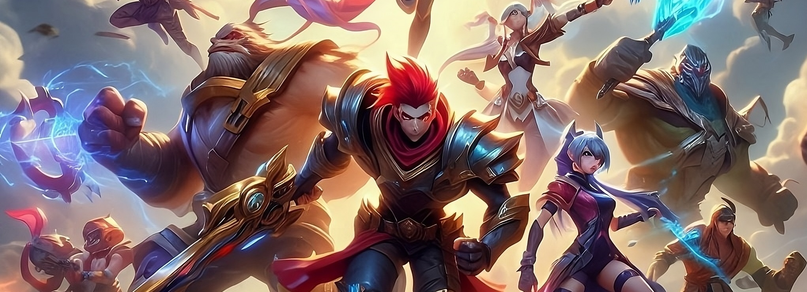

# Connect, Combat and Conquer: MatcHub, Your Matchup Forum



## What is Mathub?

[PT-BR]

Matchub é um fórum para jogadores de [_League of Legends_](#note--league-of-legends-lol)$^1$, onde os usuários podem ler e descrever as vantagens e desvantagens de cada [_matchup_ $^2$](#-matchup) do jogo. Seu objetivo é ser uma ferramenta rápida e assertiva para pesquisa estratégica, que pode ser empolgante e, em alguns momentos, desesperadora. Afinal, quem nunca correu para pesquisar a _matchup_ durante a tela de carregamento? Além disso, o Matchub busca ser uma plataforma de interação, "aproveitando" o fato de a comunidade ser "excepcionalmente educada e prestativa", proporcionando um ambiente divertido que vai além de [_Summoner's Rift_ $^3$](#-summoners-rift). Que tal compartilhar um pouco do seu conhecimento de [_monochampion_ $^4$](#-monochampion) conosco? Sua habilidade como desenvolvedor também é bem-vinda, pois nem só de _LoL_ vive o [_lolzeiro_ $^5$](#-lolzeiro).

[EN]

Matchub is a forum for [_League of Legends_ $^1$](#-league-of-legends-lol) players, where users can read and describe the advantages and disadvantages of each game [_matchup_ $^2$](#-matchup). Its goal is to be a quick and assertive tool for strategic research, which can be exciting and, at times, desperate. After all, who hasn't rushed to research the _matchup_ during the loading screen? Moreover, Matchub seeks to be an interaction platform, "taking advantage" of the fact that the community is "exceptionally polite and helpful," providing a fun environment that goes beyond [_Summoner's Rift_ $^3$](#-summoners-rift). How about sharing some of your [_monochampion_ $^4$](#-monochampion) knowledge with us? Your skills as a developer are also welcome, as a [_lolzeiro_ $^5$](#-lolzeiro) life isn't just about _LoL_.

## How build?

### Clone

Esse repositório é diferenciado, pois as pastas na verdade [apontam para outros repositórios $^6$](#-subdirectory) (se quiser saber o motivo de isso ter sido feito, ver [About The Project and Submodules](#about-the-project-and-submodules)). Assim, para clonar, é necessário seguir este comando:

````bash
git clone --recurse-submodules https://github.com/tarcidio/matchub.git
````

### Enviroment

Vale lembrar que a aplicação utiliza a API do Gmail, fornecida pelo Google, para enviar e-mails aos usuários em determinadas situações. Para que isso funcione corretamente, é essencial que a aplicação esteja adequadamente conectada à API do Google, o que envolve a configuração de credenciais específicas. Esse processo inclui a criação de um projeto no [Google Cloud Console](#). [Abaixo](#google-api), você encontrará uma explicação sucinta de como obter essas credenciais.

Além disso, a aplicação também faz uso de [serviços da AWS, como S3, SQS e Lambda](), que são essenciais para diversas funcionalidades, como automatização do envio de e-mails, gerenciamento de imagens dos usuários e suporte a outras funcionalidades futuras. Para que a aplicação possa acessar esses serviços, é necessário configurar chaves e outras permissões que permitam a comunicação com a AWS. Informações detalhadas sobre esse processo serão abordadas no [tópico abaixo](#aws).

### Docker

o que é docker
eh necessário ter instalado
basta executar:

docker-compose up -d

## About the project and submodules

on building

## Notes

###### Note $^1$: _League of Legends (LoL)_ 

Jogo eletrônico do gênero Multiplayer Online Battle Arena (MOBA), desenvolvido e publicado pela Riot Games. Lançado em outubro de 2009, é um dos jogos mais populares e influentes do mundo dos esportes eletrônicos cujo o objetivo é destruir o _Nexus_ (estrutura especial do mapa) da equipe adversária, localizado na base inimiga. Neste jogo, jogadores controlam personagens únicos chamados "campeões", cada um com habilidades específicas e estilos de jogo distintos.

###### Note $^2$: _matchup_

No jogo League of Legends, se refere a confronto direto entre dois personagens do jogo. Esse termo é usado para descrever como as habilidades, forças e fraquezas de um campeão se comparam às do campeão adversário, influenciando a estratégia e o resultado da partida na fase inicial do jogo ou em combates específicos.

###### Note $^3$: _Summoner's Rift_

Mapa principal e mais icônico do jogo _League of Legends_. É o campo de batalha onde a maioria das partidas padrão do jogo ocorre, tanto para partidas amadoras quanto profissionais.

###### NOte $^4$: _monochampion_ 

Refere-se a um jogador que se especializa em jogar com um único campeão quase exclusivamente. Esses jogadores dedicam a maior parte de seu tempo de jogo a dominar todas as nuances e estratégias associadas a esse campeão específico.

###### Note $^5$: _lolzeiro_ 

Termo informal usado no Brasil para se referir a uma pessoa que joga _League of Legends_.

###### Note $^6$: Subdirectory

Refere-se a qualquer diretório que esteja dentro de outro diretório no repositório. Esse sistema é utilizado para organizar arquivos e pastas de maneira hierárquica e lógica. Para fins de curiosidade, os seguintes comandos foram utilizados para criar esses subdiretórios:

```bash
git submodule add https://github.com/tarcidio/matchub-api matchub-api

git submodule add https://github.com/tarcidio/matchub-web matchub-web
```

Suponha que o repositório `matchub-api` seja atualizado. Para sincronizar com as novas versões, basta executar:

```bash
cd matchub-api
git push origin nome-da-branch

cd ..
git add matchub-api
git commit -m "Atualizado submódulo matchub-api com as últimas alterações"
git push
```


